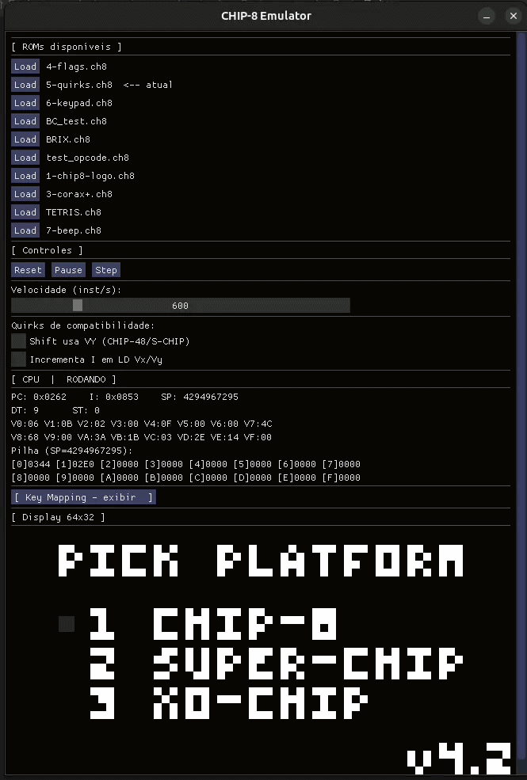

# Emulador-CHIP8
Emulador do CHIP8 com SDL/openGL e ImGUI



## 1. O que é o CHIP-8

O CHIP-8 é uma máquina virtual simples, pensada para jogos e demos:

| Recurso | Valor típico |
|---------|----------------|
| RAM | 4096 bytes (4 KiB) |
| Registradores | 16 × 8 bits (`V0` … `VF`; `VF` é flag) |
| Índice | `I` (16 bits) |
| Program counter | `PC` |
| Pilha | ~16 níveis de endereços de retorno |
| Display | 64 × 32 pixels, monocromático |
| Teclado | 16 teclas hexadecimais (`0`–`F`) |
| Timers | delay e som, decrementam a **60 Hz** |

Programas (ROMs) carregam-se a partir do endereço **0x0200**; os 512 bytes inferiores costumam reservar-se para o interpretador original — neste emulador usam-se para o **fontset** (sprites dos dígitos 0–F).

---

## 2. Pré-requisitos

- Compilador **C11** (`gcc`) e **C++17** (`g++`) — o ImGui é C++.
- **SDL2** (vídeo, eventos, temporizadores, áudio).
- **OpenGL** (textura 2D para o framebuffer 64×32).
- Leitura de uma **referência de opcodes** (por exemplo o guia técnico clássico “Cowgod’s CHIP-8 Technical Reference”).

- Dependências de compilação no Linux:

```bash
sudo apt install build-essential libsdl2-dev
```
---

## 3. Arquitetura deste repositório

1. **Núcleo** — `chip8.h`, `chip8.c`: estado da VM, `chip8_init`, `chip8_boot`, `chip8_step`, `chip8_load_rom`, `chip8_destroy`, entrada de teclado na VM (`chip8_set_key` / `chip8_clear_key` ou acesso direto ao `keypad`).
2. **Vídeo** — `texture.c`, `texture.h`: textura OpenGL alimentada pelo buffer `display`.
3. **Áudio** — `sound.c`, `sound.h`: bip quando `sound_timer > 0`.
4. **UI** — `main.c`: SDL, loop principal, mapeamento de teclas, ImGui (`cimgui` + backends SDL2/OpenGL2).
5. **ImGui** — `./imgui/` (integração típica SDL2)
